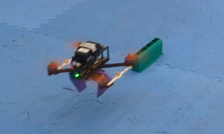

# Drone Controller

Autonomous drone flight using Model Predictive Control (MPC) and an 
Unscented Kalman Filter (UKF) for state estimation, built in ROS2/Python.
Additionally a Sliding Mode Controller (SMC) for preliminary testing.

## Demo

## My Contributions
- Trajectory generation for UKF controller (`controller_pickup/trajectories.py`)
- Implementation and trajectory generation for SMC controller (`controller_smc/`)
- ROS2 data analysis (`logs/plotting_tools/controller_pickup/`)

## Overview
This is a fork of a shared research codebase at UNSW.